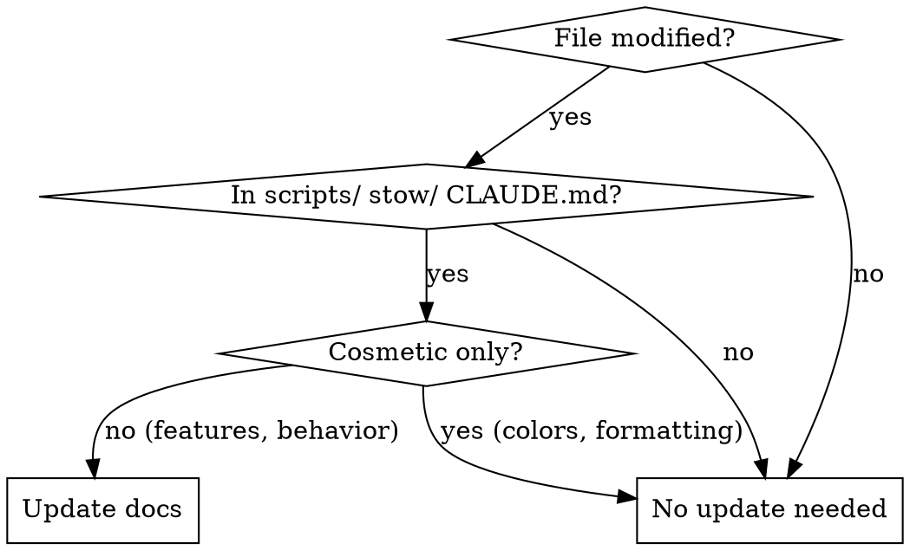
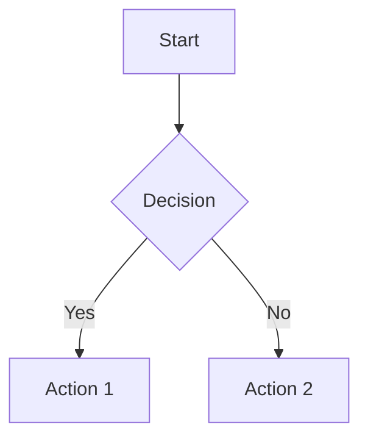

# Update Documentation

Keep VitePress documentation in sync with code changes.

## When to Update



## File Mapping

| Code Change | Update These Docs |
|-------------|-------------------|
| `scripts/install.sh` | `docs/reference/scripts.md`, `docs/getting-started/quick-setup.md` |
| `scripts/*.sh` (other) | `docs/reference/scripts.md` |
| `stow/zsh/` | `docs/guide/shell.md`, `docs/reference/` |
| `stow/git/` | `docs/guide/git.md` |
| `stow/tmux/` | `docs/claude-code/tmux.md` |
| `stow/neovim/` | `docs/guide/editors.md` |
| `stow/ghostty/`, `stow/iterm2/` | `docs/guide/` (terminal section) |
| `stow/aliases/` | `docs/getting-started/tools.md` |
| `CLAUDE.md` | `docs/getting-started/index.md` |
| New CLI tool | `docs/getting-started/tools.md` |

## VitePress Syntax

### Admonitions
```markdown
::: tip Title
Helpful information
:::

::: warning Title
Caution information
:::

::: danger Title
Critical warning
:::

::: details Click to expand
Hidden content
:::
```

### Mermaid Diagrams
VitePress has Mermaid enabled. Use for workflows and architecture:

````markdown

````

Common diagram types:
- `graph TD` - Top-down flowchart
- `graph LR` - Left-right flowchart
- `sequenceDiagram` - Sequence diagrams
- `stateDiagram-v2` - State machines

### Code Blocks
````markdown
```bash [Install]
./scripts/install.sh --all
```
````

## Project Conventions

- **Use bun**, not npm: `bun run --cwd docs docs:build`
- **No emojis** unless explicitly requested
- **Headers**: `###` for features, `####` for sub-features
- **Code examples**: Show actual commands, not placeholders
- **Diagrams**: Prefer Mermaid over ASCII art for new docs

## Checklist

- [ ] Identified affected docs from mapping table
- [ ] Used consistent header hierarchy
- [ ] Added code examples for new features
- [ ] Used Mermaid for any new diagrams
- [ ] Ran `bun run --cwd docs docs:build` - no errors
- [ ] Checked related docs that reference changed feature
