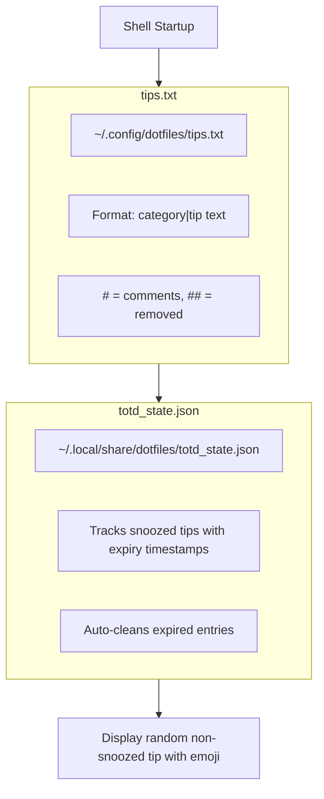

# Tip of the Day

Every new terminal session displays a random tip to help you discover and remember useful shell features.

## How It Works

```
💡 Tip: Ctrl+X Ctrl+C — Copy buffer to clipboard
   ╰─ [Ctrl+X ,] snooze 30d  [Ctrl+X .] remove
```

Tips are:
- **Non-blocking** — Start typing immediately, the tip is just informational
- **Categorized** — Each tip has an emoji indicating its category
- **Controllable** — Snooze or permanently remove tips you've learned

## Controls

| Action | Hotkey | Effect |
|--------|--------|--------|
| **Snooze** | `Ctrl+X ,` | Hide tip for 30 days |
| **Remove** | `Ctrl+X .` | Remove permanently (commits & pushes to main) |
| **Manual** | `totd` | Show a random tip on demand |

## Categories

| Emoji | Category | Description |
|-------|----------|-------------|
| ⌨️ | `nav` | Navigation & keybindings |
| 📜 | `hist` | History expansion |
| 📂 | `file` | File operations, ZMV |
| 🐙 | `git` | Git shortcuts |
| 🔧 | `tool` | Modern CLI tools |
| 🐍 | `py` | Python/uv |
| 📦 | `node` | Node/npm |
| 💧 | `mix` | Elixir |
| 📁 | `proj` | Project detection |
| ⚡ | `zle` | ZLE widgets |

## Architecture



## Adding New Tips

Edit `~/.config/dotfiles/tips.txt` (stowed from `stow/zsh/.config/dotfiles/tips.txt`):

```bash
# Format: category|tip text
nav|Ctrl+A / Ctrl+E — Jump to beginning/end of line
git|glogp — Pretty git log with graph and colors
```

## Snooze vs Remove

| Action | What Happens | When to Use |
|--------|--------------|-------------|
| **Snooze** | Tip hidden for 30 days, stored locally | "I know this, remind me later" |
| **Remove** | Tip commented out, committed, pushed to main | "I've mastered this, never show again" |

::: tip State Files
- **Snooze state**: `~/.local/share/dotfiles/totd_state.json` (local, not synced)
- **Removed tips**: Commented in `tips.txt` with `## REMOVED:` prefix (synced via git)
:::

## Disabling TOTD

To disable tips entirely, add to `~/.zsh_local`:

```zsh
# Disable tip of the day
unset -f _show_tip_of_the_day
```
