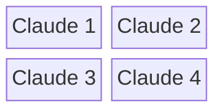

# Scripts & Tools

Complete reference for all DotClaude automation scripts and management tools.

## Core Management Scripts

### Package Management
Located in `scripts/`

#### `stow-package.sh`
**Purpose**: Safely apply stow packages with backup
**Usage**: `./scripts/stow-package.sh <package-name>`
**Features**:
- Automatic backup before applying
- Conflict detection and resolution
- Verification of successful application
- Rollback capability on failure

```bash
# Examples
./scripts/stow-package.sh git
./scripts/stow-package.sh zsh
./scripts/stow-package.sh neovim
```

#### `stow-package.sh remove`
**Purpose**: Remove stow packages safely
**Usage**: `./scripts/stow-package.sh <package-name> remove`
**Features**:
- Clean removal of symlinks
- Preservation of user modifications
- Verification of complete removal

#### `backup.sh`
**Purpose**: Create timestamped backups of configurations
**Usage**: `./scripts/backup.sh [component]`
**Features**:
- Individual component backup
- Full system backup
- Timestamped backup directories
- Compression for space efficiency

```bash
# Backup specific components
./scripts/backup.sh git
./scripts/backup.sh shell

# Full system backup
./scripts/backup.sh
```

#### `restore.sh`
**Purpose**: Restore configurations from backups
**Usage**: `./scripts/restore.sh <component> [backup-date]`
**Features**:
- Point-in-time restoration
- Interactive backup selection
- Verification before restoration
- Safe rollback procedures

### Configuration Testing

#### `test-config.sh`
**Purpose**: Test configurations before system-wide application
**Usage**: `./scripts/test-config.sh <component>`
**Features**:
- Isolated testing environment
- Syntax validation
- Functionality testing
- Performance benchmarking

## Toggle Scripts

### `toggle-neovim.sh`
**Purpose**: Switch between Neovim configurations
**Usage**: `./scripts/toggle-neovim.sh [enhanced|original|status]`

Features:
- Safe configuration switching
- Plugin state management
- User preference preservation
- Performance optimization

### `toggle-git.sh`
**Purpose**: Switch between git configurations
**Usage**: `./scripts/toggle-git.sh [enhanced|original|status]`

Components:
- Delta/difftastic integration
- SSH signing configuration
- Alias and workflow enhancements

## Installation Scripts

### `install-modern-tools.sh`
**Purpose**: Install and configure Rust-based CLI tools
**Usage**: `./scripts/install-modern-tools.sh`

Tools installed:
- exa/eza (enhanced ls)
- bat (syntax-highlighted cat)
- fd (fast find)
- ripgrep (ultra-fast grep)
- zoxide (smart directory navigation)
- delta (enhanced git diffs)
- difftastic (syntax-aware diffs)

Features:
- Platform detection
- Dependency management
- Configuration integration
- Alias setup

### `setup-zsh-enhanced.sh`
**Purpose**: Set up enhanced Zsh configuration with Oh-My-Zsh
**Usage**: `./scripts/setup-zsh-enhanced.sh`

Features:
- Oh-My-Zsh installation
- Plugin configuration
- Theme setup
- Integration with modern tools

## Automation Scripts

### `tmux-claude-workspace`
**Purpose**: Launch multi-pane Claude Code development workspace
**Usage**: `tmux-claude-workspace [session-name]`

Features:
- 4-pane development layout
- Git worktree integration
- Named session management
- Vim-style navigation setup

Layout:


## Available Scripts Summary

The following scripts are currently available and documented:

- **`backup.sh`** - Create backups of configurations
- **`restore.sh`** - Restore from backups
- **`test-config.sh`** - Test configurations before applying
- **`stow-package.sh`** - Apply and manage stow packages
- **`setup-tools.sh`** - Install modern CLI tools
- **`setup-zsh-enhanced.sh`** - Set up enhanced Zsh
- **`toggle-neovim.sh`** - Toggle Neovim configurations
- **`tmux-claude-workspace`** - Launch Claude Code workspace

## Script Configuration

### Environment Variables
Scripts use the following environment variables:

```bash
# Core directories
DOTFILES_DIR="${HOME}/dotfiles"
BACKUP_DIR="${DOTFILES_DIR}/backups"
STOW_DIR="${DOTFILES_DIR}/stow"

# Tool preferences
EDITOR="${EDITOR:-nvim}"
SHELL="${SHELL:-zsh}"
TMUX_SESSION_PREFIX="claude"
```

### Logging
All scripts support consistent logging:
- **INFO**: General information
- **WARN**: Non-fatal warnings
- **ERROR**: Fatal errors
- **DEBUG**: Detailed debugging information

### Error Handling
Scripts implement robust error handling:
- Exit codes for automation
- Rollback on failure
- User confirmation for destructive operations
- Detailed error messages

## Usage Patterns

### Daily Workflow
```bash
# Morning setup
./scripts/tmux-claude-workspace daily

# Apply new configurations
./scripts/stow-package.sh new-feature

# End of day backup
./scripts/backup.sh
```

### Emergency Recovery
```bash
# Restore from backup
./scripts/restore.sh shell 2024-06-18

# Reset Neovim to original
./scripts/toggle-neovim.sh original
```

### Development Workflow
```bash
# Test changes
./scripts/test-config.sh modified-package

# Apply and verify
./scripts/stow-package.sh modified-package
```

## Customization

### Adding New Scripts
1. Follow naming conventions (`action-target.sh`)
2. Include proper error handling
3. Add usage documentation
4. Implement logging
5. Add to main script directory

### Script Templates
Base templates are available in `scripts/templates/` for:
- Package management scripts
- Configuration toggles
- Testing frameworks
- Automation workflows